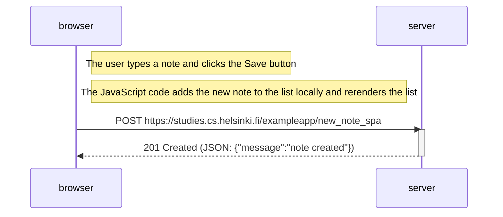

```mermaid
sequenceDiagram
        participant browser
        participant server

        Note right of browser: The user types a note and clicks the Save button
        Note right of browser: The JavaScript code adds the new note to the list locally and rerenders the list

        browser ->> server: POST https://studies.cs.helsinki.fi/exampleapp/new_note_spa
        activate server
        server -->> browser: 201 Created (JSON: {"message":"note created"})
        deactivate server
```
